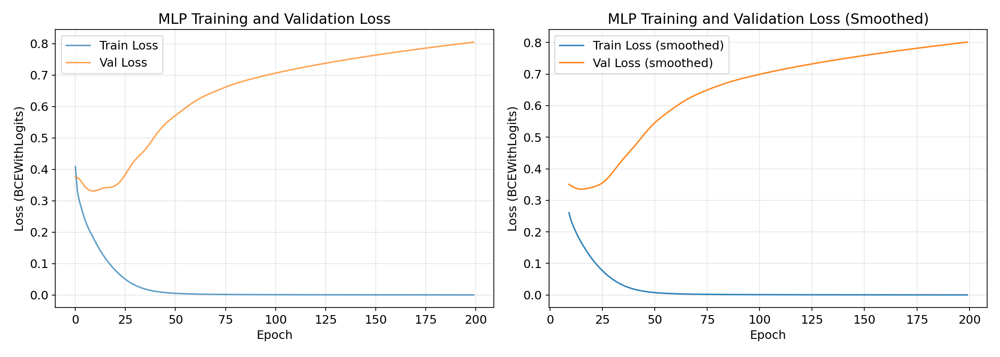
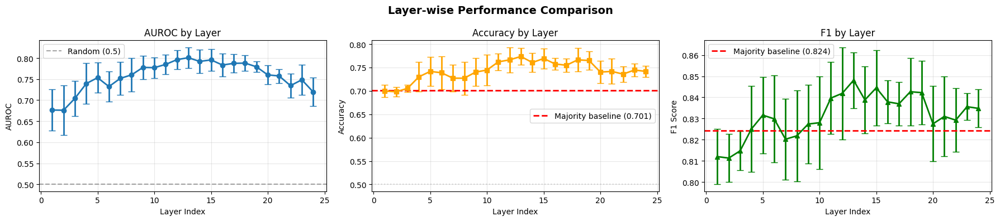
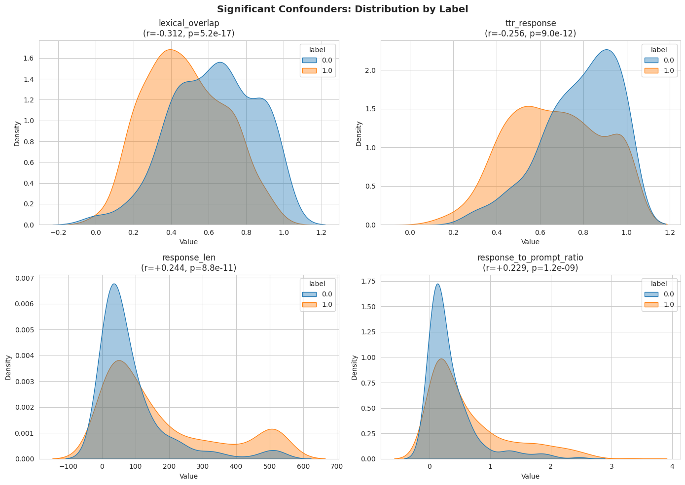
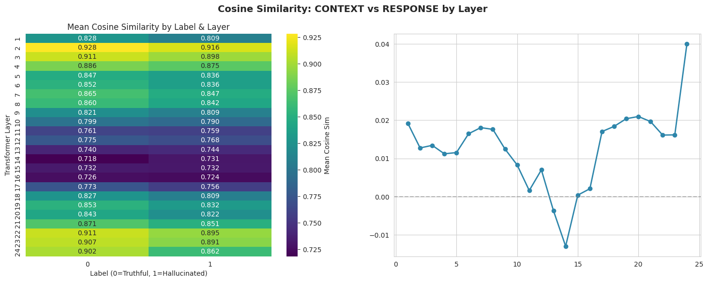
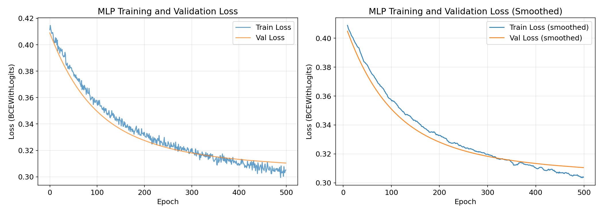
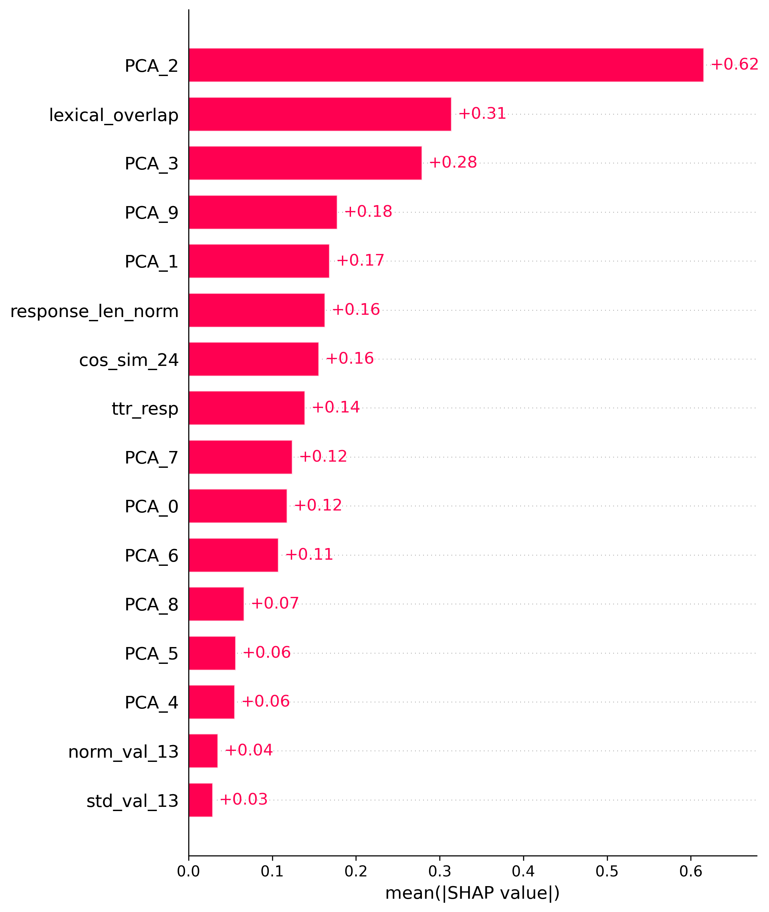

# Hallucination Detection in Small Language Models — Solution Report

## 1. Reproducibility Instructions

### Google Colab

Open the terminal in Colab and run:

```python
git clone https://github.com/ArtemVorozhtsov/SMILES-2026-Hallucination-Detection-Solution.git
cd SMILES-2026-Hallucination-Detection-Solution
pip install -r requirements.txt --extra-index-url https://download.pytorch.org/whl/cu128
python solution.py
```

### Local Setup

```bash
git clone https://github.com/ArtemVorozhtsov/SMILES-2026-Hallucination-Detection-Solution.git
cd SMILES-2026-Hallucination-Detection-Solution

python -m venv .venv
source .venv/bin/activate        # Linux / macOS
# .venv\Scripts\activate.bat     # Windows

pip install -r requirements.txt --extra-index-url https://download.pytorch.org/whl/cu128
python solution.py
```

### Implementation note:

This solution modifies solution.py, but model.py and evaluate.py are used as provided in the official repository in compliance with the competition rules.


## 2. Final Solution Description

### 2.1 Baseline Analysis and Motivation for Changes

The original baseline solution used the hidden representation of the **last token on the last transformer layer** as input features, fed into a simple **MLP classifier**. Data splitting was performed using a single train/validation/test split.

**Baseline performance:**
- Validation AUROC: 0.66
- Test AUROC: 0.73
- Test Accuracy: 0.71 (vs. majority class baseline: 0.70)
- **Train AUROC: ~1.0** = strong indicator of overfitting

The severe overfitting was attributed to two main factors:
1. **Curse of dimensionality**: The feature dimensionality (hidden state size = 896) exceeded the training sample size (689 samples in total in dataset), making the model prone to memorizing noise.
2. **Lack of regularization** in the baseline MLP architecture.

This overfitting is visually confirmed by the training/validation loss curves, where training loss approaches zero while validation loss increases.

### 2.2 Feature Engineering: From Last Token to Mean Pooling

Instead of using only the last token's representation, we adopted **mean pooling over all response tokens** at a selected layer. This choice is motivated by:

- **Semantic completeness**: A hallucination is a property of the entire response, not just its final token. Mean pooling better aggregates information across the full generated sequence.
- **Noise reduction**: Averaging reduces sensitivity to token-level noise and positional artifacts.

### 2.3 Layer Selection and PCA Dimensionality Reduction

We systematically evaluated which transformer layer provides the most informative representations for hallucination detection. The results show that:


- **Layers 10–15** (middle layers) consistently yield the highest 5-fold CV AUROC, accuracy, and F1 scores.
- **Layer 13** emerges as the optimal choice.
- Early layers (0–5) and late layers (20–24) show degraded performance, likely because early layers encode low-level syntax and late layers are overly specialized for next-token prediction rather than factual consistency.

This finding aligns with recent research (e.g., [Hugging Face Blog: LLM Hallucination Detection](https://huggingface.co/blog/krogoldAI/llm-hallucination-detection)), which suggests that middle layers capture the most task-agnostic, semantically rich representations.

For dimensionality reduction, **PCA with 10 components** was selected. This configuration:
- Explains ~60% of the variance in the pooled hidden states.
- Reduces feature dimensionality from 896 to 10, mitigating overfitting.
- Preserves the most discriminative directions for classification.

### 2.4 Confounder Analysis and Additional Geometric Features

We identified several potential confounders that could bias the classifier:




| Feature | Description | Rationale |
|---------|-------------|-----------|
| `response_len_norm` | Normalized response length in tokens | Hallucinated responses tend to be longer; controlling for length prevents the model from learning a trivial length-based heuristic. |
| `lexical_overlap` | Fraction of unique words in the response that also appear in the prompt | Low overlap may indicate topic drift or fabrication; high overlap may indicate mechanical copying. |
| `ttr_resp` (Type-Token Ratio) | Ratio of unique words to total words in the response | Measures lexical diversity; unusually low or high TTR may signal unnatural generation. |

These features were incorporated into the feature extraction pipeline. Additionally, **response length was explicitly accounted for during data splitting** via stratified sampling on the composite key `label × response_length_bin`, ensuring balanced distribution of short/long responses across train, validation, and test sets.

### 2.5 Norm and Std of Layer 13 Representations

Two additional geometric features were computed from the pooled response representations at layer 13:

- **`norm_val`**: L2 norm of the mean-pooled embedding. Reflects the "magnitude" or "confidence" of the representation. Higher norms may indicate stronger activation patterns associated with confident (but potentially hallucinated) generations.
- **`std_val`**: Mean standard deviation across hidden dimensions among response tokens. Measures internal heterogeneity of the response representation. High values suggest the model's activations vary significantly across tokens, potentially indicating inconsistent reasoning or topic shifts.

Both features provide complementary signals to the PCA components and improve classification performance when included.

### 2.6 Context-Response Cosine Similarity

We computed the cosine similarity between the mean-pooled prompt embedding and response embedding at each layer. 

Results reveal that:

- The **largest separation between hallucinated and non-hallucinated samples** occurs at the **output layer (layer 24)**.
- This is expected: the final layer is most directly optimized for next-token prediction and thus encodes the strongest signal about whether the generated content aligns semantically with the prompt.

This feature (`cos_sim`) was added to the geometric feature set and contributes to the model's ability to detect semantic drift.

### 2.7 Model Architecture: From MLP to CatBoost

After feature engineering, we revisited the MLP classifier with the following improvements:
- BatchNorm layers
- Dropout layers
- Reduced learning rate (1e-4)

These changes successfully eliminated overfitting, as shown in figure below. However, test AUROC remained below 0.80.



To further improve performance and interpretability, we transitioned to **CatBoost Classifier**, which offers:
- Native handling of heterogeneous feature scales
- Built-in regularization and class imbalance handling (`auto_class_weights='Balanced'`)
- Superior performance on tabular data with limited samples

**Final performance with CatBoost:**
- **Test AUROC: 0.83**
- **Validation AUROC: 0.79**
- Balanced precision/recall across classes

### 2.8 Interpretability: SHAP Analysis

SHAP analysis reveals that **PCA_2** is the most influential feature, with a mean absolute SHAP value of ~0.62. This indicates that the second principal component of the layer-13 pooled representations captures the most discriminative pattern for hallucination detection. While the exact semantic meaning of PCA_2 requires further investigation (e.g., examining its loadings), its dominance underscores the value of dimensionality reduction in isolating task-relevant signal.


---

## 3. Experiments and Failed Attempts

### 3.1 Dynamic/Trajectory Features (Discarded)

We explored 12 dynamic features capturing temporal dynamics of hidden states across tokens and layers:
- Norm dynamics (mean, variance, max across response tokens)
- Inter-layer consistency (cosine similarity between adjacent layers)
- Trajectory curvature (acceleration of hidden state changes)
- Representation density proxies

While some features showed statistically significant univariate separation (EDA), **adding them to the model degraded test performance by 1–2 pp**. We attribute this to:
- High correlation with existing PCA components (redundancy)
- Overfitting to dataset-specific artifacts

**Decision**: Exclude dynamic features; retain the simpler, more robust static geometric set.

### 3.2 KernelPCA (Discarded)

We replaced linear PCA with **KernelPCA (RBF kernel)** to capture non-linear manifolds in the hidden state space. While theoretically appealing, this change:
- Increased computational cost without measurable AUROC gain
- Introduced additional hyperparameters (kernel width) requiring tuning
- Reduced interpretability of components

**Decision**: Revert to linear PCA for its simplicity, speed, and sufficient performance.

### 3.3 Multi-Layer Aggregation (Discarded)

We experimented with averaging pooled representations across layers 10–15, hypothesizing that ensemble representations might be more robust. However, this:
- Diluted the strong signal from the optimal layer (13)
- Increased feature noise without improving discrimination

**Decision**: Use single-layer (13) pooling for maximal signal-to-noise ratio.

### 3.4 Linear Models and MLP (Outperformed by CatBoost)

We evaluated Logistic Regression and tuned MLP architectures on the engineered feature set. While these models achieved reasonable performance (AUROC ~0.75–0.78), they were consistently outperformed by CatBoost. We attribute this to CatBoost's:
- Better handling of feature interactions
- Built-in regularization and robustness to small datasets

**Decision**: Adopt CatBoost as the final classifier.

### 3.5 Limitations: Low Recall for Class 0

The final model exhibits **lower recall for the non-hallucinated class (0)**: it occasionally flags truthful responses as hallucinations. This is likely due to:
- Class imbalance (~70% hallucinated samples)
- Overlap in feature space between "confident but wrong" and "confident and correct" generations

**Mitigation strategies for future work**:
- Adjust classification threshold based on application-specific cost of false positives
- Incorporate additional contextual features (e.g., prompt complexity, domain metadata)
- Explore ensemble methods or calibration techniques

---

## 4. Conclusion

Our final solution combines:
1. **Mean-pooled representations from layer 13** (optimal semantic signal)
2. **PCA dimensionality reduction** (10 components, ~60% variance explained)
3. **Five interpretable geometric or statistics features** (norm, cos_sim, lexical_overlap, TTR, response length)
4. **Stratified splitting by label and response length** (controlling for confounders)
5. **CatBoost classifier** with balanced class weights

This pipeline achieves **0.83 test AUROC**, a substantial improvement over the baseline (0.73), while maintaining interpretability through SHAP analysis. The work highlights the importance of thoughtful feature engineering, layer selection, and model choice in hallucination detection tasks with limited data.